| 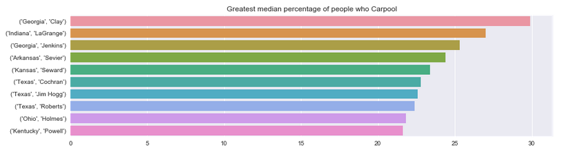 | 
|:--:| 
| *More Georgia and Texas than I was expecting* | 

# NOTE: Please redirect [here](https://www.kaggle.com/pstetz/comprehensive-look-at-the-2015-acs-estimate) for updated version

I've moved my attention from this folder to my public kernel on Kaggle.  See... https://www.kaggle.com/pstetz/comprehensive-look-at-the-2015-acs-estimate

This notebook is still respectable however!  It's just might have 1 or 2 grammar mistakes and lack plotly figures!

# US Census Data ([Kaggle overview](https://www.kaggle.com/muonneutrino/us-census-demographic-data))

This is a folder contains an exploration of the 2015 American Community Survey estimate.

All the analysis is included in the full.ipynb.  Although there are logs of earlier notebooks that you can view in the logs folder.

I recommend using this README purely as a starting point as it does not include all the analysis that I have done.  README's a bit more boring as well because they're pure text and images.

---

# Table of Contents

1.) [Introduction](#intro)

   - [Background](#background)

   - [Questionnaire](#questionnaire)

   - [Dataset](#dataset)
   
   - [Tracts](#tracts)
   
   - [County](#counties)
   
   - [States](#states)
   
2.) [General Focus](#general)

3.) [State Focus](#state)

   - [Population](#st_pop)
   
   - [Unemployment](#st_unemploy)

4.) [Numeric Focus](#numeric)
   
   - [Unemployment v. Poverty](#unemply_pov)

   - [Income](#nu_income)

   - [Commute times](#nu_commute)

5.) [Focus on Fun!](#fun)

   - [Gender imbalance](#fun_gender)

   - [Selected Counties](#fun_selected)

6.) [Resources](#resources)

7.) [ACS Criticism](#criticism)

8.) [Further Work](#further)

---

# [^](#toc) Introduction

### [^](#toc) Background

Every 10 years, the US governemt conducts a survey of the entire nation to understand the current distribution of the population.  Every citizen in the States receives a questionaire (see [questionaire below](#questionnaire)).  The idea of a Census has been since the county's founding with the first Census taken in 1790 under Secretary of State, Thomas Jefferson.

Around 1960, there began to be a greater demand for more data at regular intervals.  And after 45 years of discussion, planning, and allocation of funds, the US government expanded the Census Bureau to administer the American Community Survey (ACS).  However, there are a number of important differences in how the ACS and the 10-year Census are conducted.  The 10-year Census is required by everyone in the nation at the same time however the ACS is a rolling sample and sends out surveys to 295,000 addresses monthly (or 3.5 million per year). 

The purpose is the Census was originally to help update the Electoral College with a moving population.  The role the data takes as since expand, with knowledge of populations shifts and distributations helping the US government allocate $400 billion in funds each year

### [^](#toc) Questionnaire

The actual American Community Survey is a very long meaning I can't comfortably fit it here.  Although, if you'd like to see it, you can find a [sample form](https://www2.census.gov/programs-surveys/acs/methodology/questionnaires/2018/quest18.pdf) on the US Census website.

To get a rough idea of the questions they ask, below is the 2010 Census form.

| 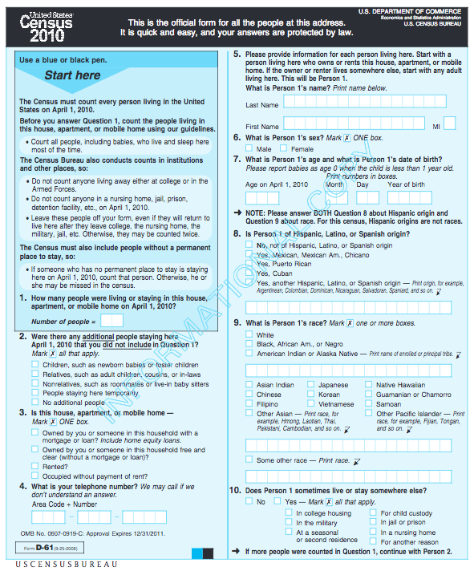 | 
|:--:| 
| *The 2010 Census form ([photo](https://www.census.gov/history/pdf/2010questionnaire.pdf))* | 

### [^](#toc) Dataset

The data comes from Kaggle user [Muon Neutrino](https://www.kaggle.com/muonneutrino) who took this data from the DP03 and DP05 tables of the 2015 American Community Survey 5-year estimates.  I recommend just using [his data](https://www.kaggle.com/muonneutrino/us-census-demographic-data) as I found the American Fact Finder website slow and a bit hard to navigate.

The two tables have essentially the same information.  The data is collected in tracts which are subsections of a county while the county data is an accumulation of all the tract data.

### [^](#toc) Tracts

The ACS is completed in Tracts.  One or many tracts make up a County however, one tract may not span multiple Counties.

To get a sense of scale, they can range from 3 to 53,812 people but are generally around 4,000 people. I realize that's a huge range, but hopefully the plots below will help!

| 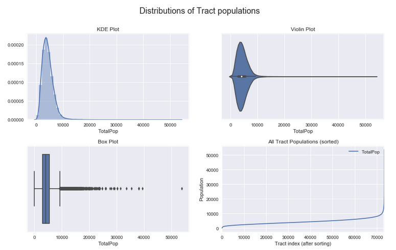 | 
|:--:| 

### [^](#toc) Counties

A County is a political subdivison of a State.  There are varying levels of influence each county can exert.  Alaska for instance has very low political power in its counties (technically they call them boroughs there) and operates mostly on the state level, however large cities like Los Angeles and New York are very strong on the county level.

For the purposes of this notebook it may help to think of Counties as just a collection of people that belong to a state.

### [^](#toc) States

Okay, we all know what a State it, but let's see some visualizations anyways

| 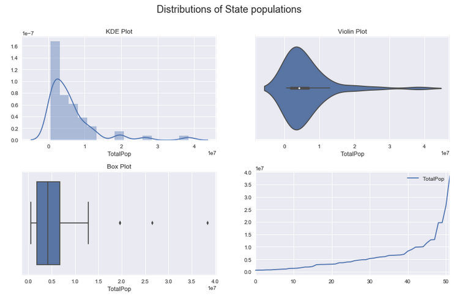 | 
|:--:| 

---

# [^](#toc) General

This looks at missing values and includes a correlation map between all variables.  There aren't good visualizations for either exploratory analysis.

---

# [^](#toc) State

### [^](#toc) Population

| 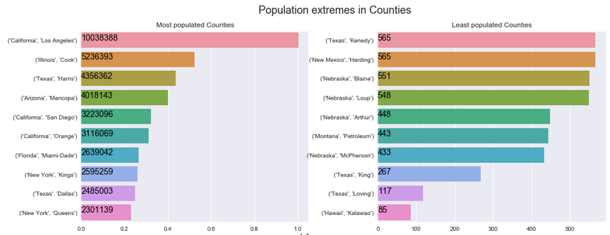 | 
|:--:| 

The results seem to line up nicely with Wikipedia's page ([link](https://en.wikipedia.org/wiki/County_statistics_of_the_United_States#Nationwide_population_extremes)), this is to be expected since the Wikipedia is using the 2016 estimate provided by the US Census bureau.

To others that may not know...
- Cooks county in Illnois is home to Chicago
- Harris, Texas contains Houston
- Maricopa, Arizona contains Phoenix

#### Fun facts!

- If the largest county, Los Angeles, were to become it's own State, it be the 8th most populous State.
- Kalawao County, Hawaii has no elected government and until 1969 it was used to quarantined people with leprosy

### [^](#toc) <u>Unemployment</u>

| 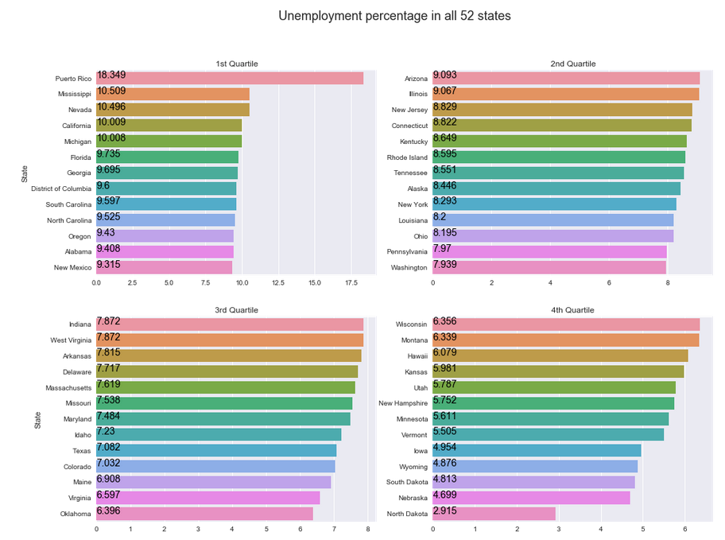 | 
|:--:| 

I never knew Puerto Rico is suffering so much.  We'll see later that Puerto Rico has the lowest Income and the highest rate of poverty too.

On the bright side, North Datoka has low unemployment because of fracking ([article link](http://fortune.com/north-dakota-fracking/)).

To refresh your understanding of Poe's law, see this [link](https://en.wikipedia.org/wiki/Poe%27s_law).

---

# [^](#toc) Numeric Focus

### [^](#toc) Unemployment v. Poverty

| 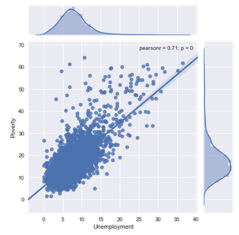 | 
|:--:| 

There clearly is a very strong relationship here.  Our intuition is further bolstered by p = 0 indicating low probability for the null hypothesis (the two variables are connected in some way).  In addition, the Pearson correlation coeffient is close to 1 meaning the variables have a positive relationship (larger values of Unemployment are more likely with higher values of Poverty).

This is just what we'd expect from these two variables.

### [^](#toc) <u>Income</u>

| 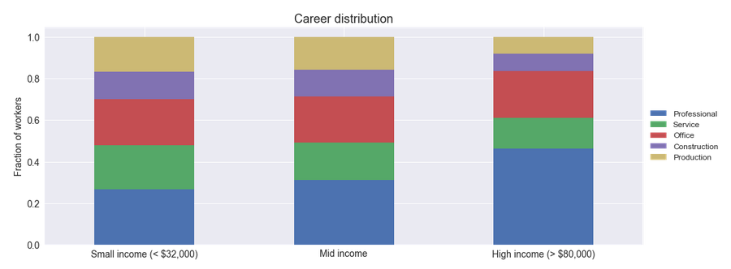 | 
|:--:| 

### [^](#toc) <u>Commute times</u>

| 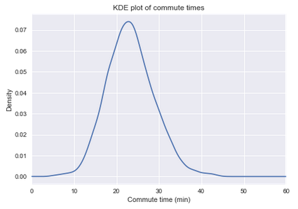 | 
|:--:| 

# [^](#toc) Focus on Fun!

### [^](#toc) Gender imbalance

| 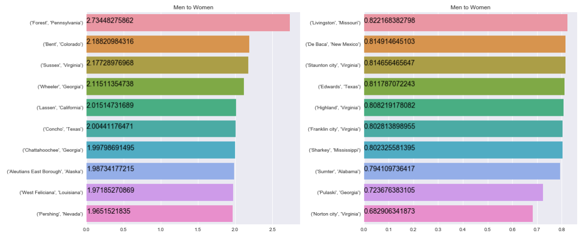 | 
|:--:| 

#### General comments

The demographics I see on Wikipedia do not match what I see here.  Norton, Virginia says there are 0.818 men to every women ([link](https://en.wikipedia.org/wiki/Norton,_Virginia)) not 0.682 men; Forest, Pennslyvannia says there are 1.112 men to every women ([link](https://en.wikipedia.org/wiki/Forest_County,_Pennsylvania)) not 2.73 men; Sussex, Virginia says there are 1.351 men to every women ([link](https://en.wikipedia.org/wiki/Sussex_County,_Virginia)) not 2.177.

This can be the result of two things:

(1) All of these counties are on the lower side of population (around 5,000 people), so small flucuations in gender populations can account for some of these results.  In addition the ACS only samples 1-in-480 households a month.  The low sampling rate in addition to the small populations could result in high errors.

(2) However it could also be the result of single gender prisons.  This would explain both why the demographic discrepancy on Wikipedia and why the population would be so low.

#### High Men to Women

Forest - Pennslyvania ([link](https://en.wikipedia.org/wiki/State_Correctional_Institution_%E2%80%93_Forest)), Bent - Colorado ([link](http://bentcounty.org/2010/11/bent-county-correctional-facility-cca/)), and Sussex - Virginia ([prison 1](https://en.wikipedia.org/wiki/Sussex_I_State_Prison)) ([prison 2](https://en.wikipedia.org/wiki/Sussex_II_State_Prison)) all have prisons within the county so maybe I'm onto something.  Also, I have been able to confirm that one of Sussex's prisons and Forest's prison are all male.

#### Low Men to Women

Pulaski, Georgia contains an all women prison ([link](http://www.dcor.state.ga.us/GDC/FacilityMap/html/S_50000214.html)).

In addition to women I expect any population on the older side will skew toward more women since women tend to live longer than men.

#### Fun facts!

- Chillicothe, county seat of Livingston - Missouri, was the first place to introduce commericial bread slicing.  And has since led the standard in "best thing"
- The Lorton, Virginia Wikipedia page has a section for [famous prisoners](https://en.wikipedia.org/wiki/Lorton_Reformatory)

## [^](#toc) Selected Counties

Finally to end this data exploration I included a chance to compare places you've lived!  I've been in the Bay Area most of my life so I choose some counties that I was interested to compare.

| 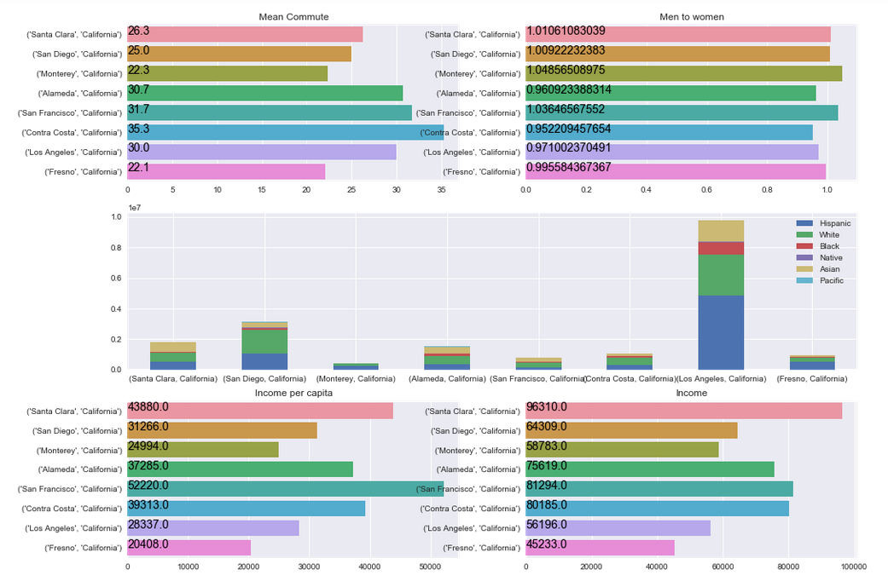 | 
|:--:| 

A few things to note

- Contra Costa has cheaper housing than Alameda, SF, so it makes sense that it's commute is long (live in Contra Costra, commute to SF or Alameda)
- I was surprised to learn LA has a shorter commute than SF
- I included the gender ratios because at these population levels they should be centered at 1 (see Appendix A in my notebook for more analysis)
- California appears to have a fair amount of racial diversity
- SF population is a lot smaller than I expected
- Income and IncomePerCap isn't surprising especially regarding SF, Santa Clara, and Fresno

# [^](#toc) Resources

- The American Community Survey website ([link](https://www.census.gov/programs-surveys/acs/))
- The American Community Survey Information Guide ([link](https://www.census.gov/programs-surveys/acs/about/information-guide.html))
- Here is the dataset for this project ([link](https://www.kaggle.com/muonneutrino/us-census-demographic-data)).  Thank you again to [MuonNeutrino](https://www.kaggle.com/muonneutrino) and [Kaggle](https://www.kaggle.com/)
- PBS Newshour has a nice explanation of the Census along with concerns for the 2020 Census ([link](https://www.youtube.com/watch?v=1Y6PI3EtA54))

# [^](#toc) ACS Criticism

- To my fellow Americans: take a guess who would be first! ([link](https://www.lewrockwell.com/2004/07/ron-paul/its-none-of-your-business/))
- I'm worried how often people refuse to answer questions and how that affects data quality ([see example](https://www.youtube.com/watch?v=bYwdOxOBwgM)).
- The estimated budget for 2019 is $3.8 billion ([link to census budget](https://www2.census.gov/about/budget/2019-Budget-Infographic-Bureau-Summary.pdf)).
- Take a look at the [sample questionnaire](https://www2.census.gov/programs-surveys/acs/methodology/questionnaires/2018/quest18.pdf) from 2018 and decide if the questons are too invasive.

# [^](#toc) Further Work

- Have country visualizations using the Bokeh library (Plotly is also good)
- Use less Wikipedia in links
- Explore MeanCommute as a function of county population
- Look at US population data over time
- Analysis of really old Census data (from 1800s)

